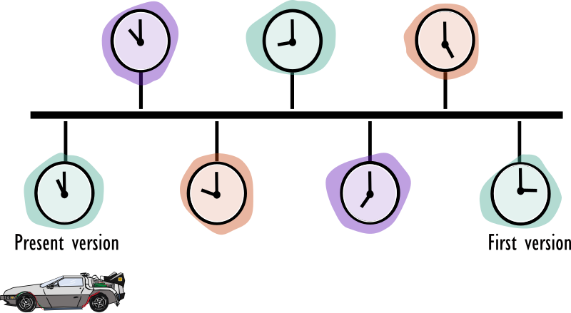
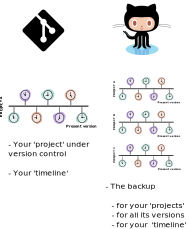

# 2. Introduction
Have you also been in a similar and recognizable situation as depicted below? Saving different versions of your files and scripts is essential to keep track of changes, though it can become chaotic very quickly if we do not use the excellent tools we have available to us. Git is one of these excellent tools. It works similar to [Google Docs'](https://support.google.com/drive/answer/2409045?co=GENIE.Platform%3DDesktop&hl=en) history feature in which Google automatically saves your document and the changes that happened at a particular moment in time. However, Git allows you to control and decide yourself when changes are worth saving, hence making it much **more powerful and flexible**. Each change is saved together with a message that enables you or your collaborators to keep an overview of the history of the project.  

Git is an open-source tool that keeps **track of the changes** made to your project files throughout their history. Your history is organized like a time-line, ordered in space and time. Keep that in mind, we will travel together during this course, using this analogy to make life easier at the same time as we have fun learning Git & GitHub. 

So imagine git has an amazing **Time machine**, that will help us travel within a timeline (git project history) that we are going to build together. Each project where you initialize Git, to start a git repository will have its own timeline, and each point in time is one version you have chosen to keep for future reference. Now I'm going to help you through with our "DeLorean car" and together with Marty McFly and Dr. Emmett Brown we can sit tight and travel within the space-time of your project. What I mean is , you will save many versions of your project, and by the end of this course you will be able to go back in previous versions if so you wish. But be careful, the past can be visited but should no be changed!

## Why should you version control? 

- **Keeping track of changes** to your files done by yourself or your collaborators. At any moment you can exploit the history of the project to see who wrote what on a particular day. It even allows you to go back to a specific version or undo specific edits. 
- **Synchronizes files between different people or infrastructures** (i.e. laptops, servers, ...), making it a powerful collaborating system. 
- **Testing new code/changes**. Git can control multiple alternative versions of the same project in which you can make some changes and only when you or your collaborators are happy with them, you can include them in the main version.

## The difference between Git and GitHub
There is a major difference between Git and GitHub though. Imagine Git is your repository, it will help you manage each of your projects' versions, independently. It also give you the power to go to your previous versions, like if you had a "time machine". GitHub, in other hands, is where you keep the **backup** of one or more **time-lines** (one or more projects history or "time-line"). 

In summary, git is software that works on your computer (locally), whereas GitHub is a service for connecting and uploading/downloading files much like saving files in the cloud (remotely). There are some alternatives for Git ([link](https://www.g2.com/products/git/competitors/alternatives)) which will not be discussed in this course, and there are some for GitHub with Gitlab and Bitbucket as main competitors. These alternatives essentially share the same concepts and therefore we choose for the tools that enjoy the most traction in the community, **namely Git and GitHub**. 

In this course we will learn how Git works on your computer, giving us a proper understanding of its functionalities. Grasping these concepts is important if we want to use Git in other apps (e.g. in [Chapter 11](https://material.bits.vib.be/topics/git-introduction/tutorials/11_github_rstudio/tutorial.html) we will learn how GitHub and RStudio interact).

---

Let's go to the [next session](https://liascript.github.io/course/?https://raw.githubusercontent.com/vibbits/introduction-github/master/tutorials/3_getting_started/tutorial.md#1)!
