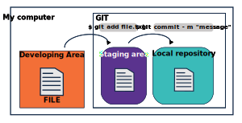
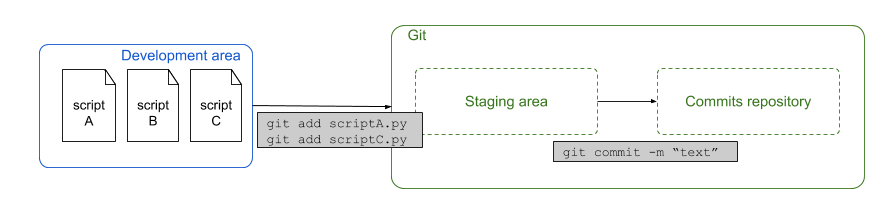
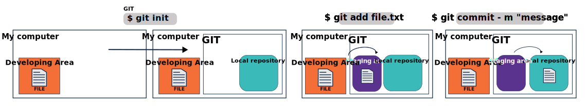

# 3. Get started with Git

Git is organized in areas, not all of them visible , but trust me THEY ARE THERE!
Understandind this areas will make it easier to navigate in this new world.


## Three conceptual areas

Before diving in, let's have a look at how Git works. Git has actually 4 conceptual areas, and we are going to talk about 3 of them now.

It's important to understand the three conceptual areas that exist **locally** when using Git on your computer, they are: the (1) **development area**, the (2) **staging area** and the (3) **local repository** . The local reposiotry contain the `commits`, commits are versions you decide to keep for future reference, and they are ordered like in a **time-line**. 

We already know that we want to use Git for keeping track of versions of our files, and by consequence of keep track of what changes happened. 

So let's understand better these conceptual areas: 
- first we edit a file on our computer (development area)
- then we tell Git about it (add it to the staging area)
- lastly we save this changes in the locally ( local repository).


1. The **development area** is where your coding or your project happens. Usually this is a folder with multiple files on your computer. Git will never change anything at this level, actually it won't really do anything. The only thing Git does is helping you managing this area by remembering that it needs to keep track of changes made in this folder or its files. However, for this we first need to initialize Git on this folder (only once in the beginning).  

2. The **staging area** is an intermediate stage which assembles the files that contain changes. We can select one or multiple files with changes and stage them for a commit. This means that we're telling Git that we will want to save those changes. Hence, imagine that we want to save a file, we first have to add it to the staging area before we can commit it.  

3. The **local repository** is a hidden file that will keep a history of all your **commited** versions. What I mean with 'commit' will become clear very soon. Once you move things from the staging area to the local repository, you have stored a specific version of each file. Committing is a synonym for saving the files in Git terminology, you can think of it as you are commited to a change you have made, and now you create one version of your file in your local repository. The local repository contains a list of all the `commits` that you have done in a project. It's neatly structured in a history log or, how we call here, in a timeline which we can travel through and check any point in time whenever we need. Notice that all of this is still happening on **our computer**. 

<center></center>

Here's an example: Let's assume that we're starting a new project. Usually that also means that you make a new folder on your computer where you will keep all the files related to the project. By doing that you can start devloping what you plan, but **Git** is not yet helping you managing it. In other to have Git managing it with you, you need to follow a few more steps.


## My first commit

You now have your folder and 1st file and you need to tell Git to start tracking changes and help you with version control. Using the **terminal** go to your folder, and inside your developing area (the folder) you can initialize a local Git repository (This step should be done only one time).

So here it is the first Git comman you need to learn:

To initialize the local repo

`$ git init`

When we initialized Git on the folder it means git will start seeing everything inside that folder and it's subfolders. It does **NOT** mean it is already keeping track of your versions. The local repository is acttualyy a new hidden folder called `.git/` and it will store the different versions of your work. This structure allows us to only see in the folder the latest version of the files, while all the versions (points in your timeline) will be managd by git in the `.git/` directory.  Remember that and be very carreful with this directory, any damage or deleting it will crash your old versions storage, your local repository.

You still have an empty local repository once you have now **initialized** your local Git repository. A good thing to do is actually checking and filling your config file before we start saving points in our time-line, so they are identifiable. Check on the Note bellow how to do it. 

<center></center>

 🚨 **Important Note** 

> Not everytime you need, but it is good to configurate your user information to use Git, the reason will become clear soon! Also, you might get a warning if it is not yet configured. To do it you can use the commands bellow to include your name and e-mail in the config files. These are the same command if you want to update them later on. 
>``` 
> git config --global user.name "yourgithub username" 
> git config --global user.email "your_email@domain.com" 
>``` 
>
> If you want to check if the information is already there you can use:
>
>``` 
> git config --global --list 
>``` 


The next thing you need to do is to tell **Git** what you want to keep track of. Git will help you with management, but the main choice and the planning is yours! 

First, you'll have to `add` it to the staging area and afterwards you need to `commit` it to the repository. As showed in the image in the previous chapter. But let's try to do it together before I explain more about this two steps:

```
$ git add dictionary_of_concepts.md
$ git commit -m "my 1st commit"
```

These commands will subsequently add the file `<file>` to the **staging area** and then commit it to the **commit repository**. 

Now you have your first point in the timeline. If you have installed **Ungit** you can open a new terminal, go to your developing area and enable the software by typing `ungit` to load the page, this will show in a tree structure all the `commits` you have done. Initially it will look like a time-line, and each point is one version of your developing area.

If you can't open it, what you have is something like this:

<center></center>

If you make a second file, the only thing we have to do is adding it to the staging area and then commit it again!

Same is if you modify this document and you want to keep the new changes in your local repository.

<center></center>

Notice that the repository is not yet visible on [github.com](https://github.com/). For this we would still to link local and remote repository and share the content between them. You will soon be introduced to this.


## Commiting, an important message

We have created our first commit, and if you paid attention you saw that after `git add` you do `git commit` followe by **-m "message"**. And this is  **VERY** important step. When commiting your changes, you must make sure to describe what this point in time is representing and we do it by adding a meaninful message:

```
git commit -m <meaninful mesage>
```
<center></center>

🚨 **Important Note** 

>
> When thinking of a menaingul message, what do you think?
>
> What would you need this for?
>

When writing a message you can describe every change you commit to and why. You write a message for your future self and for others so they understand what was intended. To help you think about it, you can consider the following questions:

* Why was it changed?
* How this adresses the issue?
* What effects were generated by this changed?
* What are the limitatins of this change?

Not everytime all questoins can be aswered, maybe there ir no effects or limitations to the change. But there is alwyas a reason **why** and a explanantion on **how it was adressed**.
Don't worry, I know it is easier said then done! But I have a friend that says: Is better more information then missing information, so be as descriptive as you can.

So my message for you is: do not give up! Keep trying! Only practice brings perfection!

If by any chance we wouldn't pass along the `-m <message>` parameter, git would open the editor asking to write the commit message there. It's good practice to write powerful commit message that helps your future self to determine what has changed in this commit. 


In the end, the usual Git routine looks like this:
-

<center></center>

## Staging before saving
Maybe, at this point, you are wondering why we need to  use an intermediate area (`git add`- staging) before we do `git commit`, and not go straight foward to do a `commit` ?

So far we have worked with only one file, but in a real life project you will most likely have several files and subfolders with all sorts of things, codes, data, images, documentation, etc. So before you commit you need to organize your files. Since we are talking about a time-line, let's think of history classes and history books. You have historical facts that are related being described along the same chapter, and as you move to different blocks you might realize different contexts. 

We will give a practical example based on the figure below: 

---

<center></center>

---

Imagine that you're working on a project with multiple Python scripts and you're working on all of them. In this case your folder in your development area contains the files  `scriptA.py`, `scriptB.py` and `scriptC.py`. The changes that you made in script A and script C are somehow related, but script B is not. It's good practice to make commits in which changes that are related to each other are bundled. Hence, in this case we want to make one commit with the changes from file A and C. Now we can simply add scripts A and C to the staging area and commit it. The changes in script B will remain unsaved until we commit the changes in a separate commit. 

It's always better to have more commits; in case you want to remove part of your work in a later stage, or you want to start your work again from a specific commit. 
So organizing your commits, means adding together in to the **staging area** (`git add <file>`) things that make sense together, so one unique message (`git commit "meaninful mesage"`) can make sense. 

Now we have a few ways to stage more than one file, depending on the situation:
  1. `git add <file>` : will add a **specific** file to the staging area
  2. `git add .` : will add **all** the changed or new files to the staging area
  3. `git add *.py` : will add all files that have a '.py' extension
  4. `git add <file1> <file2> <file3>` : will add all listed files

Defining the balance of how many times and what to stage and commit is something only you and your collaborator can do. But think of it like this, if you have several commits that are related you might end up with very repetitive messages and such a long time-line. As consequence finding back what you want will be too chanllanging. In other hands, if you put too much in one commit or just wait very long and commit it all at once, you might end up with very vague messages that will not help you find what you want either. 

Remember the messages you must think in yuor commit to plan your staging area:

* Why was it changed?
* How this adresses the issue?
* What effects were generated by this changed?
* What are the limitatins of this change?

So if you add three, four, five files together, they will be linked to the same message.

Another way to look to it, is like a llibrarian:

<center></center>

You have many documents, you classify them, put them in the cart (your staging area) and send them with one single note (your commit message) to be storage in the same session in the shelves (your point in time).

I hope it is making as much sense for you as it does for me now!


# The strength of the staging area


---


## How far can my Local Repository track changes?

As said before, you should `git init` just once per project. 

Git is able to see all files, directories, sub-directories, sub-sub-directories, etc. What will not happen, is that git will not look up in the directory structure. See the example bellow:

```
Documents
|_images
|
|_music
|
|_directory_a
| |_subfolder
|
|_my-project
  |_documentation
  |_data-example
  |_scripts
  | |_ script.py
  | |_ script.js
  |
  |_ilustration
  |_.git

```
In this example `.git` can track everything inside of `<my-project>`, all the subfolders like `documentation`, `data-example`, `scripts`, `ilustration` and all the files and directories withing these. But it cannot see anythin above in the hierarchical tree, like `images`, `music` and `directory_a`.

This is specially important because if you initialize two or more git local repositories, you might have trobles knowing in which of them you are actually commiting. 
So in the exampl above, even if you commit a change in the `scripts` directory or directly from `my-project`, the same local repository `.git` will track all changes.

But let's think of a hipothetical situation ...


```
|_my-project
  |_documentation
  |_data-example
  |_scripts
  | |_ script.py
  | |_ script.js
  | |_.git
  |
  |_ilustration
  |_.git

```
Now you have one local repository `.git` initialized in `my-project` and another in `scripts`. The first one can track changes in all folders, just like describe in the example above. But the second one only tracks changes inside `scripts`. How do you make sure to `git commit` in the right place? What is the right place? How do you keep a history without duplicaoitns or missing parts?

Well, I don't have a good answer for that, other than: AVOID CREATING TRUCTURES LIKE THIS! Do not initialize a git repository within an existing one!

---

# Summary of commands


<center></center>


---

Let's go to the [next session](https://liascript.github.io/course/?https://raw.githubusercontent.com/vibbits/introduction-github/master/tutorials/4_time-travel_my_versions/tutorial.md)!
