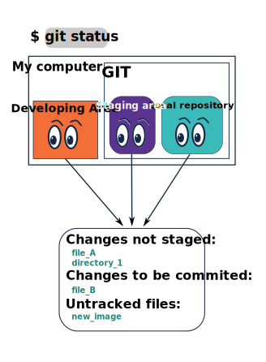

# 4. A travel in Time: Check your versions 

We have seen how to save points in time by commiting new versions of what ever you are developing. 
But you are most likelly interested in comparing old versions of your history to the current version and maybe even recover older versions.

Let's do it one step at the time.

Before checking into the past I want you to know how to check your current situation. Have you staged and commited all recent changes? What if you don't remember? Maybe you will findout there is a file that you completelly forgot to commit at all.

## Check the status

It is good advise to check the status between your developing area and your local repository ad git can display the state of your working directory and staging area. The command that we'll use for this is `git status` and depending on the situation the output will look differently, but it will always give you some informative status description.

```
$ git status
On branch main
Your branch is up to date with 'origin/main'.

nothing to commit, working tree clean
```
The first sentence tells us that we're on the `main` branch, which is the default branch name in Git. What git call **branch** we have been calling time-line. 
YES! Your time-line has a name, and it is `main`. But more on branches later. 

The second sentence tells us that our local branch is exactly the same as our origin. This means that all of the files and folders within our local project are identical to the ones in the remote GitHub repo, if it was already set. But don't worry about it yet! 

Lastly, git tells us that there is nothing to commit, which makes sense as we don't have any changes at the moment. 

> 📖 **ACTIVITY**
> 
> Let's make some changes to one of our files again.  Check the status again with `git status`.
>

```
$ git status
On branch main
Your branch is up to date with 'origin/main'.

Changes not staged for commit:
  (use "git add <file>..." to update what will be committed)
  (use "git restore <file>..." to discard changes in working directory)
        modified:   file.txt

no changes added to commit (use "git add" and/or "git commit -a"
```

This time, git tells us that there are changes in the file and they are not in the staging area. There are two options here:
- Use `git add <file.txt>` to add the changes to the staging area 
- Use `git restore file.txt` to remove the changes from your working directory. This will undo the changes that you made since the last time you committed it. 

> 📖 **ACTIVITY**
> 
> Add the file to the staging area and check the status again with `git status`
>

```
$ git status
On branch main
Your branch is up to date with 'origin/main'.

Changes to be committed:
  (use "git restore --staged <file>..." to unstage)
        modified:   file.txt
```
The file is now in the staging area and we have two options:
- Use `git commit -m "some informative text"` to commit the changes to the commit repository
- Use `git restore --staged file.txt` to remove the file from the staging area.

Let's do the latter, check the status again and then remove the changes from your working directory. 

> 📖 **ACTIVITY**
> 
> Last, try to add a new file, an image or text file that you have never staged nor commited. Now check the status again.
> 

```
$ git status
On branch main
Your branch is up to date with 'origin/main'.

Untracked files:
  (use "git add <file>..." to include in what will be committed)
        file.txt
```

The new file is untracked, meaning Git can see there is a new file, but you have never staged or commited, therefore git hasn't 'touched' it yet and is telling you to start staging this file to be commited after all.


<center></center>

In summary what is happening is that git will look in all 3 conceptual areas and try to give back an informative list. And if everything has been commited you will get the message **nothing to commit, working tree clean**.

## The history (log)

Besides checking the current state of your project with `git status`, there is also a possibility to have a look in your commit history. In order to list all your previous commits, enter `git log`. The output is a long list containing several blocks like this:

```
commit e2d7e9a0b4614a6bee6b3ffd7583237125671dc1
Author: username <user@xyz.com>
Date:   Wed Jan 01 01:23:45 2020 +0200

    The informative commit message
```
`git log` lists all commits made to a repository in reverse chronological order. Each commit starts with an identifier which is a unique code for each commit (hash). Besides the identifier, the commit’s author and date are given, and the commit message is given.

If we have pushed the commits to our Github repository (online) we will see the last commit ID somewhere in the upper right corner. This is a verification for us so we know that the remote repository is up to date with the local repository. Can you also find an overview of all commits in GitHub? 


---

Git log can be extended with many other parameters, e.g. combine it with the `--oneline` argument, or add `--graph` to display the commit history as a text-based graph and `--decorate` to indicate which commits are associated with the current HEAD, the current branch main, or other Git references. As for all git command you can alwyas use `--help` the way it should look is `git log --help`, but you try it to get more informaiton in any git commands and its options.

Other interesting options for the history (`log`) can be `-n <no>` to limit the ammount of commits you want to see, for example `git log -n 3` will return the last 3 commits. While `--abbrev-commit` will give you the shortest possibe unique identifier for al commits in the list.


## Comparing versions

You need the unique identifier of each commit to be able to use this functionality in git. And here, I want to bring you back to one of our first reflexions in this material:

<center></center>

Whith this many versions, if you want to compare them, and maybe recover something good that was in a previous version, or just check how it has changes and the original meaning/structure.

I'll introduce you two way to do it.

<center></center>

### Git Show

You can ask git to `show` you the content of two files, and it will highlight some changes for you and also give you the messages of each commit for a reference. If you just want to see the previous version you will use it as you see below:

```
$ git show e2d7e9a0b4614a6bee6b3ffd7583237125671dc1 
  Author: User Name <email>
  Date:   Thu Aug 3 13:24:57 2023 -0300

        Very meaninful message of this commit

  diff --git new_file.txt
  new file mode 100644
  index 00000...00002134
  + # title
  - # old title
  +
  + text
  + text

 ```

There is a lot of information there, but if you look into it by parts, it get's easier. In the begining you have the information about by Whom, When and Why this changes were made. Then you have informaiton about a new file that was committed for the first time (new_file.txt). At last you have a sequence of lines that are starting always with either a **+** or a **-**, plus is showing you the new lines on a pair-wise comparison and minus is showing you lines that were deleted. Looking back in the example you can observe that the Title o f the document was replaced.

If instead of one ID you give two IDs `git show ID_1 ID_2` you will have all this informatin for both files in a sequence from the newst to the oldest version, and you can compare them by tracing and reading both information.

```
 git show e2d7e9a0 b4614a6be 
  Author: User Name <email>
  Date:   Thu Aug 16 10:54:07 2023 -0200

        Very meaninful message of this commit

  diff --git new_image.png
  new file mode 100644
  index 00000...00008658
  diff --git new_doc.pdf
  new file mode 100644
  index 00000...00002134
  + # title
  +
  + # intro
  + text text
  + ilustration

  Author: User Name <email>
  Date:   Thu Aug 3 13:24:57 2023 -0300

        Very meaninful message of this commit

  diff --git new_file.txt
  new file mode 100644
  index 00000...00002134
  + # title
  - # old title
  +
  + text
  + text

```

That might not be the most practical thing, but already gives you more power and freedon to look back in time and how different versions of your work might look like.

### Git diff

In this case, despite of wokring very similar to `git show <id> <id>`, you will see a merged comparativer version printed.

```
diff --git a/new_file.txt b/new_file.txt
index a71586c..823afdf 100644
--- a/new_file.txt
+++ b/new_file.txt
@@ -1 +1,8 @@
-my new file
+
+my new
+
+file
+
+with
+
+new lines
```

In the above exmaple you can see that `--- a/file.md` represents one version while `+++b/file.md` is the other version. Since the comparison is happening pair wise, what you see in this example is that the 1st line used to have the text and is now replaced (`+`) by one empty line. The first line was actually moved down and splited in two, followed by new text. Let's put it in an image: 

| old version | new version | What you see |
| --- | --- | --- | 
| `+ my new file` | `+____` | `- my new file`|
| - | `+ my new`| `+ my new` |
| - |`+ ____ `| `+ ____`|
| - |`+ file`| `+ file`|
| - |`+ ____`| `+ ____` |
| - |`+ with`| `+ with`|
| - |`+ new lines`| `+ new lines`|

So git is summarizing for you the changes lines by line, so you can see how it evolved between to log IDs.

---

**Intermezzo / extra reading**:

When the output of git log is too long to fit in your screen, git uses a program to split it into pages of the size of your screen. When this “pager” is called, you will notice that the last line in your screen is a :, instead of your usual prompt.
- To get out of the pager, press `Q`.
- To move to the next page, press `Spacebar`.
- To search for `some_word` in all pages, press `/` and type `some_word`. Navigate through matches pressing `N` (next).

---

Let's continue with the [next session](https://liascript.github.io/course/?https://raw.githubusercontent.com/vibbits/introduction-github/master/tutorials/5_Connecting_2_GitHub/tutorial.md#1)!


