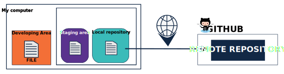
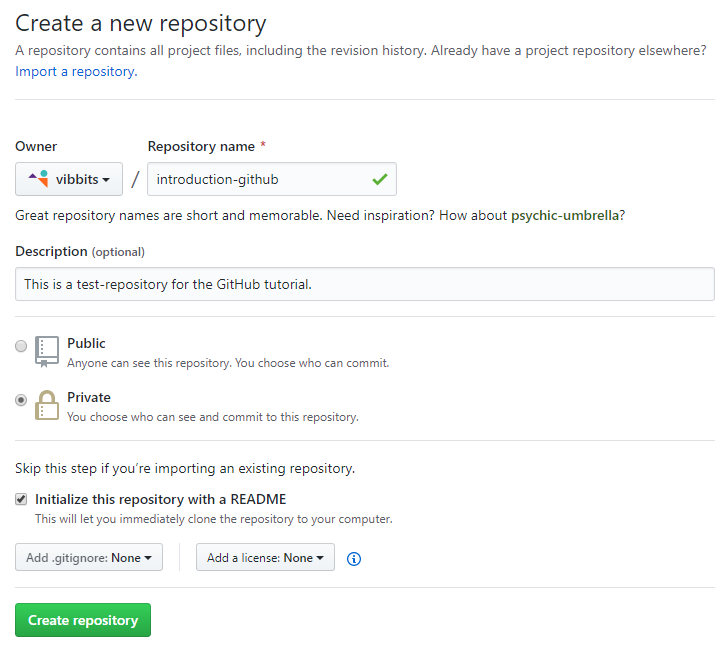
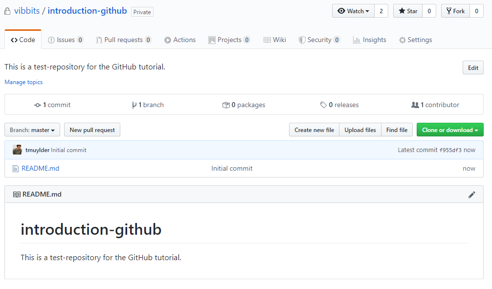
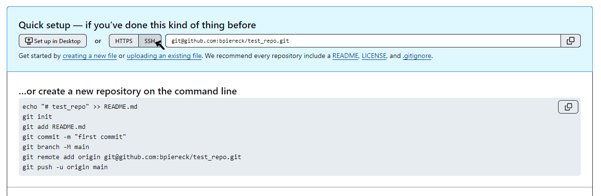
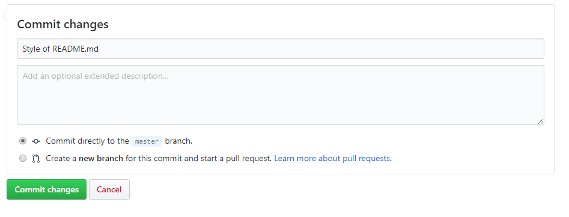
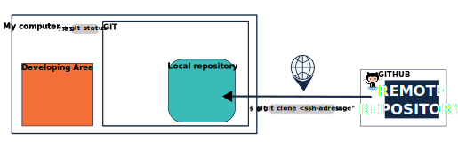
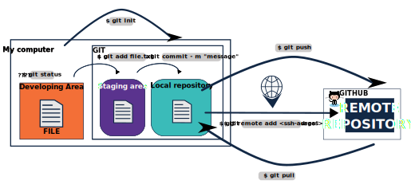

# 5. Connect to GitHub

We need to talk about the fourth and last conceptual area!

Can you name it?

The **Remote** repository, in this course represented by **GitHub**, is the last conceptual area. So far we have created a timeline that only existis in our computer. But If we want to collaborate that will be a complicated task, if your computer crashes all the versions are lost. So The remote repository is where you are going to keep your back up. You can also do some developing from there, I'll also show you this trick in the end of this chapter. But first, let's stick to the terminal a little longer. 

<center></center>

## Connecting to GitHub

That's all you need to know: `add-commit-push` x repeat. This repetition represent 90% of how we interact with Git & GitHub. 

Before we can start pushing, we have to start a version controlled project/repository. There are two ways of **initializing a new Git repository** which only has to be performed once right at the start:

One of them you've learned in the previous chapters
- Initialize Git on a folder on your computer: see [Section 3](https://github.com/vibbits/introduction-github/tree/master/tutorials/3_getting_started)   
```
$ cd ./project_folder
$ git init
```

The other way is:
- Clone a GitHub repository (from GitHub)
```
$ cd ./folder_with_no_git_repo
$ git clone <repo>
```

Both options will work just fine and it depends on your preferences or maybe the situation of the project which one is preferable. The first option can be used if you're about to start a new project, the second option can be used when you already have some files in a project which you now want to start version controlling. 


### Create a new repository from GitHub

Go to your GitHub homepage and click on the '+' icon in the upper right corner and select 'New repository'. The following screen will pop up.


---

<center></center>

---


We already filled in a repository name and an optional description. You can choose to already publish your repository, however as this is a meaningless repository, we will choose not to. When you're about to start a new project, there are three things to consider:

- For a new repository, it's a good practice to initialize the repository with a [README file](https://docs.github.com/en/github/creating-cloning-and-archiving-repositories/about-readmes). This file will eventually include a (general) description about the project, what others can expect to find in the project and how they can use it. 

- Adding an `.ignore` file is something we will cover later, however for now it suffices to know that the `.ignore` file will contain some code which tells git to exclude certain files from tracking and avoids uploading them to GitHub.

- Adding a license makes sense when your project becomes public. It defines under which license the content is made available. More information on licenses is available [here](https://elearning.bits.vib.be/courses/writing-a-data-management-plan/lessons/licences/).

In this example, we have initialized the repository with a README file and click 'Create repository', which will then look like the image bellow.

**But for now, you will initialize one wihout any `README` or `.gitignore` files nor include a license, because it will prevent you from connecting this repository to a local repository. And for the next exercise, we will connect all we have in our local repository to a github project.**


---

<center></center>

---

This is the home page of our GitHub repository. From here we can already do a lot, like changing or uploading files. We initialized a GitHub repository with a README file and we can see that we have only one file in this repository: a `README.md` file. By default the text in this README file is the title of the repository and the description that we created here above. Notice that it's a Markdown-file as we can see by the `.md` extension, similar to an ordinary text file on your computer with a `.txt` extension. Markdown is enriched text allowing us to create formatted text using plain-text. More information related to markdown can be accessed from the Github guides [here](https://guides.github.com/features/mastering-markdown/).  


### Connecting Local and Remote repositories

As presented in the previous chapter, you can also create a Git repository from your computer. This is especially useful when we already have a project with a bunch of files and you have already initialized a **local Git repository**. 
```
git init
```
Why do we want to store this project and all of its files on GitHub? Imagine that you lose your computer now, you've also lost your project (and all the files in it). A bit less drastical, if you would just like to show your project to your colleagues or with the whole world, we need to publish it somewhere on the internet. And that is exactly what GitHub does for us. 

Unfortunately, it is not possible to create a GitHub repository from our computer. Hence, we need to open GitHub and create a new repository and **DO NOT** initialize it with a `README.md`, `.gitignore` or a license. It is important that it is **empty** in the beginning. And we can add those files later.

Once created, GitHub will seggest commands that you might want to use on the Terminal to push our first changes to this GitHub repository. 

We already initialized Git in our folder, so we can skip this step:
```
git init
```

THe following steps basically ask us to commit our first changes. Given that we edited the README file:
```
git add README.md
git commit -m "first commit"
```

But these steps are not new for you anymore!

WHAT WE NEED IS TO LINK THIS GIT REPOSITORY TO OUR GITHUB REPOSITORY!

GitHub will try to help you all along, but let me guide you into this. Look the image bellow, that is what you will see when you create an empty repositry in GitHub.

<center></center>

You want to select 'ssh' option for repositories you own or collaborate to. Otherwise you can use the 'https' line. Copy this line and in your terminal you can run the following command to link it to the GitHub repository>

```
git remote add origin <ssh adreess>
```

the ssh adress should look like this: git@github.com:tmuylder/testtt.git
The command to create a link only needs to be used once and only if there is no link already there. You will see in the next session that sometimes this is automatic created.

And finally push our commit to GitHub. The argument `-u` or `--set-upstream` will set the remote as upstream (see later):
```
git push -u origin main
```

If you go back to the image above, you will find both command lines as the last two in the image. It is GitHub communicating with you, and helping you out.

If you forget to set upstream main, git, in your local repository will also try to talk to you, and tell you what you need to do!

But be aware, this is only creating a link or a bridge as I like to think. Nothing is cossing the bridge yet, for that you need to follow one more step, you need to 'push' things through the bridge. using this command:
```
git push
```

When you do this only the things you have commited, all files, all versions (timelines) will be sent to GitHub, keeping a backup of all you have developed so far.
And everytime you want to backup a new commit or a few new commits, weather they have updates or new files or both, you should do it again!
By pushing your commits repository, you will push the files within the project to GitHub. After this last step, your project and all of the files are accessible in a GitHub repository. 

```
$ git add
$ git commit "meaninful message"
$ git push
```

Tha is your new routine!!!

### Bring the remote repository to your computer

But what if you have started it all in GitHub and now wants to have a local copy, what do you do?

Now that we created the repository in GitHub as shown in the begining of this chapter, we want to work on it on our computer. Therefore we need to download it, i.e. we have to **clone** it. Click on the green button 'Clone' and choose any of the options:
- Clone: with https link (if you **are not** owner or collaborator) or with **SSH** (if you own or collaborate).
 This will download the repository and all its contents, keeping the link to the GitHub repository. 
 Other options are:
- Open with GitHub Desktop (this might be interesting for you at a later stage).
- Download: will download all of the contents in a zipped file, however **loses the connection (the bridge)** to the repository.  

With the your Terminal, navigate with `cd` to the folder where you want to keep your project folder and type the following:
```
git clone <link>
```
with `<link>` being the link from GitHub that will look something like this for SSH: `git@github.com:username/repository-name.git`. This command is only used once in the beginning and creates a new folder on your computer with all the contents from GitHub. 

Our local copy (clone) of the GitHub repository is now able to communicate with the GitHub repository. Every change within this repository is traceable, whether it is a new file or changes to a file. When we make changes in our local repository (e.g. create a new file), you have to add the file to the staging area first (`git add`) and then commit it (`git commit`) before pushing it (`git push`) to GitHub. 

```
git add <file>
git commit -m "some text that explains what has changed"
git push
```


During our adventure through Git & GitHub we'll use some specific glossary. Confused on what the meaning of all these new words are? Check out the [GitHub glossary](https://help.github.com/en/github/getting-started-with-github/github-glossary).

### Keep it syncronized
Weather you change something in GitHub (change a file, upload a new directory) or you are collaborating, you must keep it syncronized with your local repository!
For this we need to use the `pull` command to pull in the changes from GitHub. 

Let's go back to our repository on GitHub. We will make a change in the repository on GitHub and then pull these changes back into the repository on our computer (i.e. the project folder on our computer). 

Click on the `README.md` file in the list of files and click the pencil icon on the upper right. The file will open in an editor mode and we can change the title from *introduction-github* to *Introduction GitHub* or we can add some more descriptive text. Note that a README file is by default a markdown-file. Markdown is a text file with lay-outing options. If you haven't heard of it before, it's worth some [further reading](https://guides.github.com/features/mastering-markdown/).

Save the changes by committing them as depicted here below:

---

<center></center>

---

GitHub is now one commit ahead of our local repository. Hence, we have to pull this commit into our local repository. We can do this by using the following command:
```
git pull
```

Open the file `README.md` and check whether the changes have merged in.  


# Summary of commands


<center></center>

<center></center>


---

Let's go to the [next session](https://liascript.github.io/course/?https://raw.githubusercontent.com/vibbits/introduction-github/master/tutorials/6_gitignore%26README/tutorial.md#1)!
