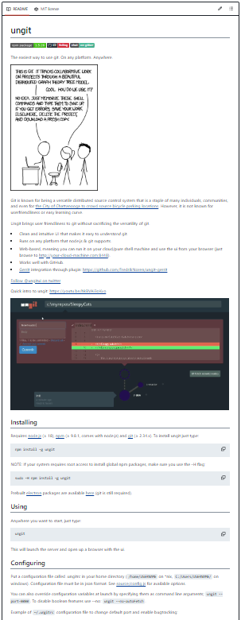
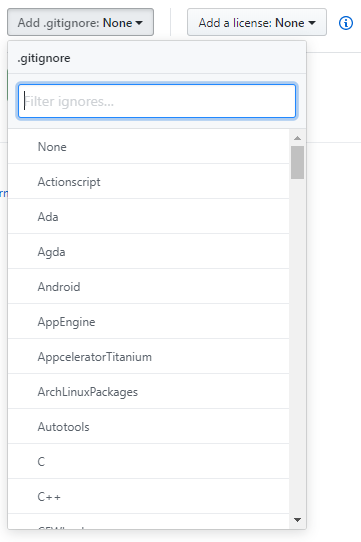

# 6. READM & .gitignore - Importante files

# README please

The README file, was commented before, but this is a very important file, you can have it without any extension `READE` or, what I advise is that you have a markdown version `README.md`, this way you can have a nicelly formated file.

But What is this file about?

This file is meant to have a description of your repository, it can be a presentation of a project, tool or training material for example. If you are describing a rool, maybe you also want to include the how to install and use it and links for testing data. For a training material, such as this, usually description of the course for students and other trainers.

It will be the first thing people see when they visit your GitHub page, and it will help understanding what they can find and how they can use this repository. See some examples in the images bellow:

--- 
example 1: 
A short description of a Containers workshop, with some links related to the course.
<center></center>

---
example 2: 
Repository of VIB RDM (_reseach data management_) course material.
You can find the authors, liscence and description
<center></center>

---
example 3:
[Ungit](https://github.com/FredrikNoren/ungit), a tool to help you visualize the Git working tree and bringing user friendliness.
You have an explanantion, functions, intallation and how to use.
<center></center>

---

# Ignore me please

What if we have files that we do not want Git to track for us, like backup files or intermediate files created during data analysis? Remember that GitHub is **not** your next cloud storage infrastructure. Hence, **(big) data** should **not** be uploaded on GitHub. In fact, there's a strict file size limit of 100MB so you won't even be able to do so. 

Regardless of the above, it is often useful if your data is in the same projectfolder. And you can't help the fact that Jupyter Notebooks makes intermediate checkpoints (.ipynb_checkpoints) in the same folder of the notebook. 

Git has a file, the `.gitignore` file in which we can write expressions that define the files it should ignore. This chapter will briefly discuss the `.gitignore` file with a few simple examples. 

## Expressions
Imagine the following project folder structure:

```
 project-folder/
    |
    |- .git/
    |- .ipynb_checkpoints/
    |- .Rhistory/
    |
    |- data/
    |   |- R1.fastq
    |   |- dataset.csv
    |
    ...
```

Let's discuss how to ignore a specific file and how we can use symbols to generalize the ignoring behaviour.     

- **Ignore a file**:

The easiest would be to define the file or the path to the file. E.g. the fastq file can be ignored by adding `data/R1.fastq` to the `.gitignore` file. 

Similar to a file, a folder can also be ignored. The folders `data/` and `.ipynb_checkpoints/` can be ignored by adding the following lines:
```
data/
.ipynb_checkpoints/
``` 

- **`*`, `!` and `#`**:

The asterisk is often used in `.gitignore` files and represents a wildcard. E.g. `*.csv` will ignore any csv file in your folder and subfolders. The asterisk can precede a file format in which case it will ignore all the files with that format (e.g. ignore all csv, fastq, sam, bam, xlsx, pdf, etc. files). 

An exclamation mark is used for exceptions. The following lines of code will ignore all files in the data folder, except for the `dataset.csv` file:
```
data/
!data/dataset.csv
```

Documentation lines are preceded by a `#`. 

# Standard files

It's always good to think this through and manually add the files or folders that need to be ignored. However, it's also useful to know that there are standardized `.gitignore` files. These files have been created based on a specific programming environment. They are all accessible in [this repository](https://github.com/github/gitignore) and contain `.gitignore` files for Python, R, Ruby, Java, Perl, C++, amongst many others. These files can also be added on the fly to a new repository by initializing the repository with one of these files (see figure below). 

--- 

<center></center>

---

Let's continue with the [next session](https://liascript.github.io/course/?https://raw.githubusercontent.com/vibbits/introduction-github/master/tutorials/7_collaborating_GitHub/tutorial.md#1)!
