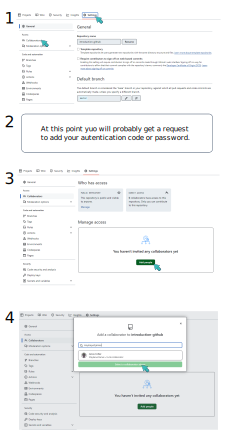

# 7. Start a collaboration

I'll take the risk to say that most time we are not working alone, and even you are the exception, in some point you might want to give access to someone to collaborate with you in your repository.

Once you have your GitHub instace, your remote repository you can choose if it Public or Private. This is only defining who can see your repository. If it is public, everyone can see and clone your repository. If it is private, only you and your collaborators can see it. 

But even if it public, not everyone can just edit your files, for that you need to give collaborator privilleges!

To do it, you need to go to GitHub, find the repository you want to add a collaborator and once you are in the repository you go into `settings > collaborators > select a collaborator` (check the details in the imagae bellow). Once you do this, your collaborator will get an email to accept or reject this collaboration. Considering you have a super nice project and he accepts, he now has access to develop in your repository. 

In the 4th step you can find your collaborator by their GitHub username or email with witch they register in GitHub. This is the email, in either case, where the collaboration request will be sent.

<center></center>

Once the collaboration has been accepted, in order to start working on it one need to `git clone <ssh-adress>` to import a fully fuctional local repository. This way you can work from your local repository, while the collaborators work in their own local repositories and everyone will `push` and `pull` from the same GitHub repository (remote repository).

## Be aware when collaborating

When you grant someone a collaborators' privilege, it means this person can commit and push anything in the repository without your supervision. If you want to manage what is pushed there is another way to setup a collaboration and it will be introduced in the short future when we talk about **forks**. But the collaboration as I'm showing you now, won't give you this opportuunity.

Nonetheless, you are still the only owner, so this repository's name cna only be changed by you, as much deleting it permanently is only for you to decide, none of your collaborators.

But with all of this in place, there are some things you need to pay attention during a collaboration with 1+1 or 1+++ peple (as many as you wish and can handle).

Remember that you need to keep **ALL** local repositories syncronized with the remote repository. If you try to push something in GitHub, before pulling the updates made by your collaborators, you will be facing a **conflict**, and I mean literally. Let's suppose you both worke din the same file, remember that when using `git diff` git compares lines in the same position to tell you if they have changed. It will be the same here, so let's suppose you add the following text in line 58

> _my new collaborator's name_ 

and in other hands your collaborator added, in the same line a different text:

 > _I'm the new collaborator and this is my name_

 Git will ask you to decide which line you want to keep. Maybe, like in this case, one of them is enough, so you delete one and keep the other. But if they are complementary information, you might want to keep it all.

> All possible solutions
>
> 1 - you keep option 1
>
>> _my new collaborator's name_ 
>
> 2 - you keep the collaborator's option
>
>> _I'm the new collaborator and this is my name_
>
> 3 - you creat a completley new version
>> _my new text_
>

 **DON'T PANICK**, all solutions are possible and you will see how to do it very soon in this chapter. But for now I need you to visualize the possibilities.

 It might be an interesting feature, but again, this is not *only* under your control. The last person to try to push will see this message and be invited to solve the conflict. It can be you or any of your collaborators.

## Best practice when collaboraitng

So be mindfull, alwyas try to syncronize it all by using `pull` before you start working and `push` after you finish. So everyone can be syncronized.

But even more than that, there are safer and more organized ways to ork when you stablish a collaboration. One way is creating branchs (check the next chapter), but in if i'm allow to keep doing analogies, so far you are working with one linear timeline, when working with branchs you are creating parallel timelines that can ae connect by a common point in your timeline. It will be more clear in the next chapter. 

When using branchs you both can develop and test things at the same time, without interfering with each-others work, and as consequence, avoiding frequent conflicts. And later on when you are satisfied you can merge your work.

Another way to collaborate safelly, and even having the possibility to manage what will be merged or commited in your repository is forking a repository. In sumarry you create  a copy of a repository, and the new copy despite of linked with the original, has a competely independent life. Later own you canmake a `pull request` and ask to merge the changes, and the owner of the original repo will evaluate and allow or not this step.

We will see more about this two possibilites, but it is importante that you keep in mind these are the safest ways to collaborate.

# Solving conflict

Before we move on to branchs and forks, you need to know how to solve conflics. Conflicts are inevitable in this life, and I have no intention to bring up an existencial crises. But weather you are collaborating in the same file, merging branchs or requesting to `pull` from a forked repository, this is bound to happen and the way git will commuicate it to you is as you see bellow:

```
Auto-merging <file_name>
CONFLICT (content): Merge conflict in <file_name>
Automatic merge failed; fix conflict and then commit the result

```

Once you have this what you need to do is refresh the file if it is open, or open the file where the conflic exists (possibly more than one file). Inside the file you need to find the structures that highlight the conflicts for you:

>
> <<<<<< HEAD
>
> I'm scamander from "_the fantastic beast_", Harry Potter collection. Pickett is my friend.
>
> \========
> I'm Pickett, I'm a male Bowtruckle
>
> \>>>>>> 1763765483393gcs92bvc9823csd2344c 
>

Above ou see that the `<<<<<<<<` symbol delimits the where the content of one file starts, and is telling you that this file is in `HEAD`, the branch name. It could be the ID of a commit or the name of another branch also. As it follows you have `========` that delimits the end of this text and the start of the next text in what you have a conflict. In the end you have `>>>>>>>>` that will delimite the end of the second file and it's ID or branch name.

With the file open you can edit this text as you wish, delete it all, keep it all, anything is possible. It is very powerful and, with great powers comes great responsailities!
If you dont delete the lines that are delimiting the text `<<<<<<`, `======` and `>>>>>>` they will become part of your next version. So remember to leave only what you would like to keep. For example:

>
> I'm scamander from "_the fantastic beast_", Harry Potter collection. 
> Pickett is my friendand he is a male Bowtruckle.
>


Just edit the file, save it and close it. After tis, follow the same routine you are already used too:

```
$ git add *
$ git commit -m 'message'
$ git push
```


---

Let's continue with the [next session](https://liascript.github.io/course/?https://raw.githubusercontent.com/vibbits/introduction-github/master/tutorials/8_branches/tutorial.md#1)!