# 8. What's a branch?

So, we have been working with one unique and linear time-line. The idea of branching is that we can have parallel time-lines, meaning we create a copy of the project in which we can add a new feature, teste different solution for the same problem, work in parallel with our collaboratorsg, etc. 

Each branch is a completely separate version of your project and lives next to your original version. In fact, it's been originated from one of your commits and now will evolve independtly.

If a new-feature is working properly on the `new-branch`, or whatever you are developing has achieved a good developing point, we can merge it back into the project so all updates start to co-existe in the same timeline again. This is a great strategy of testing new changes in some code when you're not sure whether it will work, and in the meanwhile not messing up the code that you already have, or even a wonderful way of collaborating without having frequent conflicts to solve.


<center>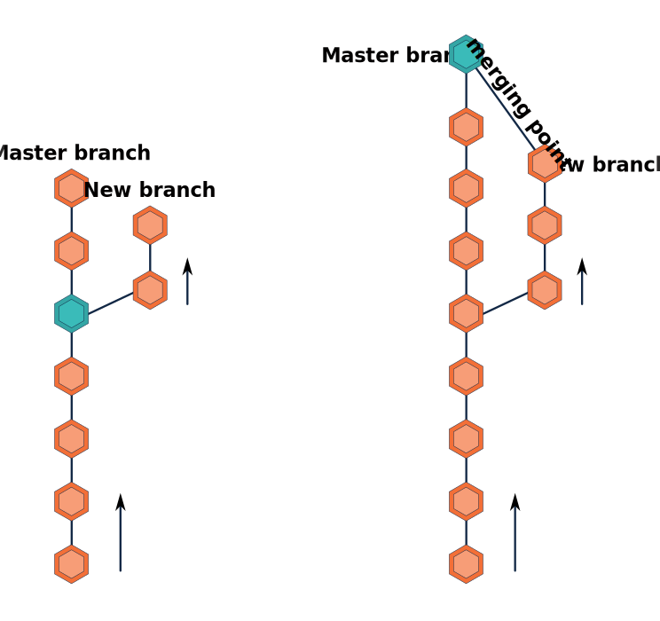</center>


In the image you can see that the original repository, called *master* branch, has a green commit is indicating the moment the new branch was cerated (left image). You can name you new branch as you wish (e.g. *new-feature*), but be mindful so you can remember what was being developed in that branch.

In the following image (on the right), after some work has been done in both branchs, the green commit is now pointing to the moment these two were merged. In this example. at the moment the new branch is created, both *master* and *new* branchs share 5 commits in its history [ `git log` ]. From that point on, until they are merged again, they evolve completly independet from each other.

## Branching

There are two ways of branching: (1) locally or on the (2) GitHub website. 

It is good to know that a repository can have numerous branches. Branches are ways of organising work on a project: you can have a branch for a new feature, for trying out something new, for exploring an issue - anything at all.

It’s a good practice to create a new branch for every new bit of work you start doing, even if it’s a very small one. Branches are of course disposable, you can always remove them later. 

Before you start making branches for the upcoming activities, push all the new changes you have:

```
$ git add *
$ git commit -m 'message'
$ git push
```

**SO, NOW, HOW CAN I START BRANCHING?**

### Branching locally

There is always an indication in the Terminal of which branch we are in (i.e. *master*). And if you can't see you can always use `git status` to check the branch among other things. 
It is time to start branching:

```
$ git branch <name-new-branch>
```

This command will create a nre branch, but not move you inside it, so if you imediatelly start editing, you are still working on *master*.
Here is where our time-machine will start helping us travel in space and time.

<center></center>

Get inside of _de Lorean_, tighten your sitbelts and let's move into our new branch:
---

```
$ git checkout <branch-name>
```

with this you can move back and forth into different branchs where you are dveloping different features or check your collaborators development.

if you want to create and imediately move to your new branch in one step you can do:

```
$ git checkout -b <new-branch-name>
```

> **Note**
> that if you use `git checkout -b <name>` and use a non-unique name, meaning you giving the same name to a branch for the second time in the same repository, you would have created two branchs with the same maybe one in your local repository and another in your remote repository. This is error prone and will lead to problems! Hence, it is really important to use unique names, having local and remote up to date and be carreful to switch to an exisiting branch and not create a new one!
>
>> One way to avoid it is by listing all the branchs that exist in your project:
>>
>> ```
>> $ git branch -a
>> * master
>> remotes/origin/HEAD -> origin/main
>> remotes/origin/main
>> remotes/origin/new-feature
>> ```
>> In the output you can see the first branch is our local *master* in which we are currently working (as denoted by the asterisk \*). The three others, in this example, relate to the branches that exist **remotely** on GitHub. If we want to work on the branch *new-feature* we will have to import it first with: `git checkout new-feature`. Git will understand that there is a remote branch with the same name and you want to work on this one. 
>> 

### Branching on GitHub

We can make a new branch on GitHub. 
1. Click the button: 'Main'
2. In 'Find or create a branch...' type `new-feature` (or any other name)
3. Click 'Create branch': new-feature

---

<center>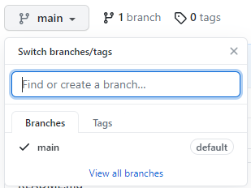</center>

---

GitHub will now display `new-feature`. It's very important to understand that any changes that happen in this branch, will not be influencing the main branch. 

---

Switch back to your *master* branch and have a look to the `plot2.R`-file. It shouldn't contain these changes. 


## The _mirror effect_ 

Now that you can creat and work on new branchs there is a very important thing that you need to understand in order to avoid confusion.

I have mentioned before, that you only visualize one version of each document in your developing area. But here is the trick, Git is a magic kindom, where you can travel space and time if you use the right spells, or commands if you prefer.

When we are working with branchs it is still true! But using the right spells will change the reallity in wich you are looking at.
Let me try to ilustrate that for you:

Imagine that you have 2 extra branchs additionally to your _marter_. In a working tree shape, you have something like the image on the left. You have commist 1 and 2 that are shared by all branchs and represente the development of **file_A**. Then you create _test_ (`git branch test`) where commits 51-53 are exclusive to this time-line and involve the creating of **file_Z**. Later, you commit changes to file_A and then create _new-feature_ (`git branch new-feature`). The former has commits 21-23 as part only of its history. As you can see at the right, they co-exist inside Git, and Git can manage their different time-lines, each of them with an independent history. But your developing area can only show one at a time, that is while I like to think of the developing area as a mirror. The mirror will reflect one of the realities, the one you choose (`git checkout <branch_name>`). I hope it will become clear in the next images.

<center>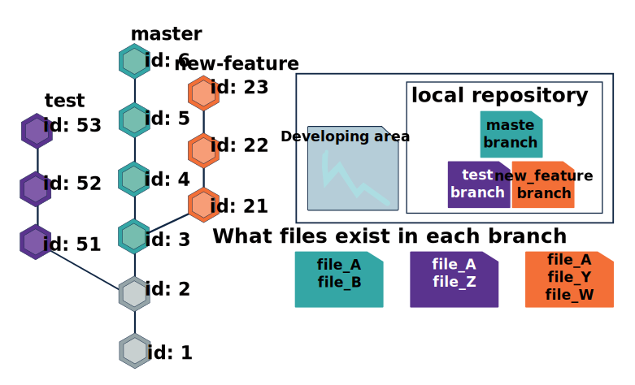</center>

So imagine you are still in branch _master_ and you were continuously developing in this branch. In the image above this is represented by commits 1-6, where **4, 5 and 6** are exclusive to branch _master_, you can see in your **developing area** two files, named **file_a** and **file_B**.

<center>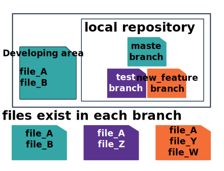</center>

If you do `git checkout test`, you will see now **file_A** and **file_Z**. It is important to notice that you need either to refresh your developing area or close-and-open it again. For example using `ls -la` in your terminal or just going in file explorer in the project folder. Now, your developing area is reflecting the branch _test_.

<center>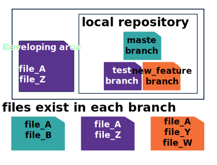</center>

Eventually you do `git checkout new-feature`, and you refresh your developing area. Now it will be refecting branch _new-feature_, therefore will be displaing **file_A**, **file_Y** and **file_W**.

<center>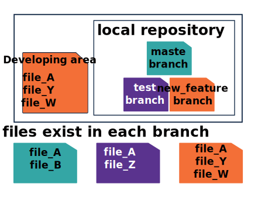</center>

So do not freak-out if you `ls` your folder or open your file explorer and things are not there, probably they are just in a different branch!

## Merging branches 

<center>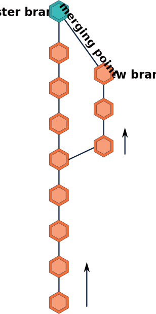</center>

### Merging Locally

To merge branchs is in theory simple, in practice you will face a few challanges. But at this point you should know how to handle them.
The command-line is simple and intuitive, as most git commands. Go to branch `master` and in your terminal type:

```
$ git merge <branch_name>
```

In theory you can do from whatever direction. Possibilites are endless, it depends on your planning, intentions and desired outcomes.

<center>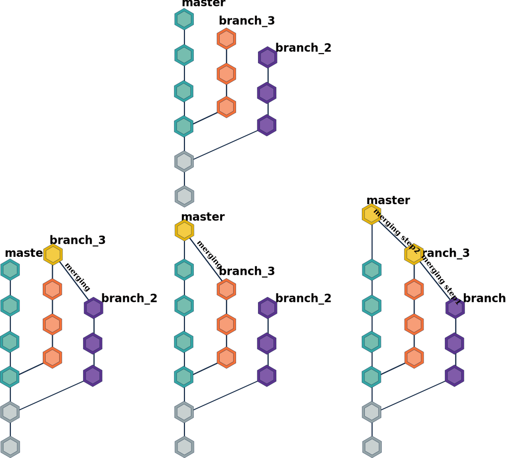</center>

The challange you might face many times when doing this, is facing a conflict. Just like in [chapter 7](https://github.com/vibbits/introduction-github/blob/master/tutorials/7_collaborating_GitHub/tutorial.md) you can solve this conflict and commit your changes in order to proced with the merging.

### Merging on GitHub

Branches are merged by making a **pull request**. In this section we will explain how to do a pull request, often shorted to PR. 

Whether you are on the *master* or *new-feature* branch, doesn't matter. In both cases you should see the following yellow screen. Alternatively, go to 'Pull requests' and find it there. 

---

<center></center>

---

Click on **compare & pull requests** or go to the section **Pull requests** and create a **New pull request** (select the branches you want to incorporate). A new screen pops-up with the following information.

---

<center>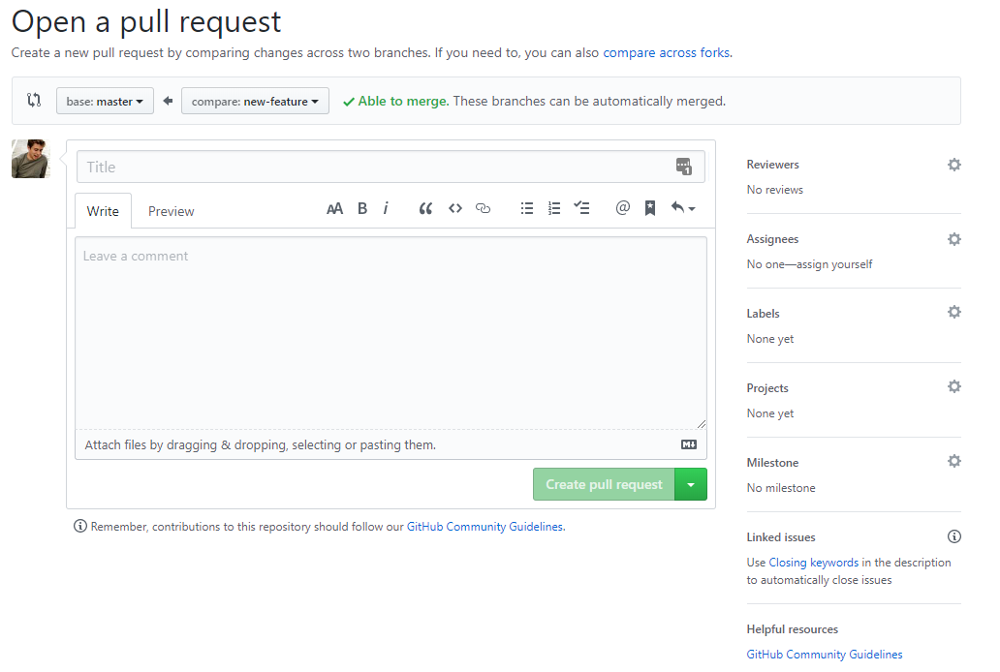</center>

---

- The pull request should be interpreted as a request to pull the new branch and all of its changes into the main branch.   
- The base where it would be pulled towards is `base: main`. The branch where the changes are deriving from is `compare: new-feature`.   
- Note that GitHub checks the compatibility of the branches: in this case there are no conflicting edits and the branches can be merged together.   
- Give a descriptive title text and if appropriate some additional comment. 

Underneath the pull request related information, GitHub also gives you a summary of the changes that were done. 
- Each commit from the branch *new-feature* (i.e. only added these 7 lines in this case)
- Display of the file and a visual representation of what changed in that commit. 

---

<center>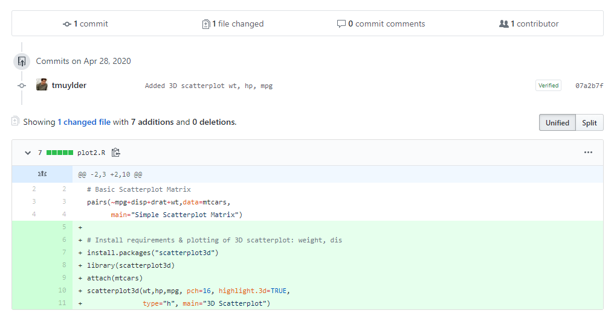</center>

---


Click on **Create pull request** to finalize the creation of the PR. Note that the the branches are not merged yet, one more comment before we do that! We know that GitHub allows us to collaborate on projects. Here we can find some of the features that GitHub is providing us to start collaborating. We could for example start a conversation here and discuss the PR, select a (couple of) reviewer(s), add assignees who authored, add labels representing what type of edits were done in the branch, etc. Essentially these are valuable for organizing bigger projects; keep track of who's working on what and who needs to review specific changes, etc.     

Finally, we verify the merge pull request commit and you give your consent to GitHub to merge both branches by clicking 'Merge pull request'.

---

<center>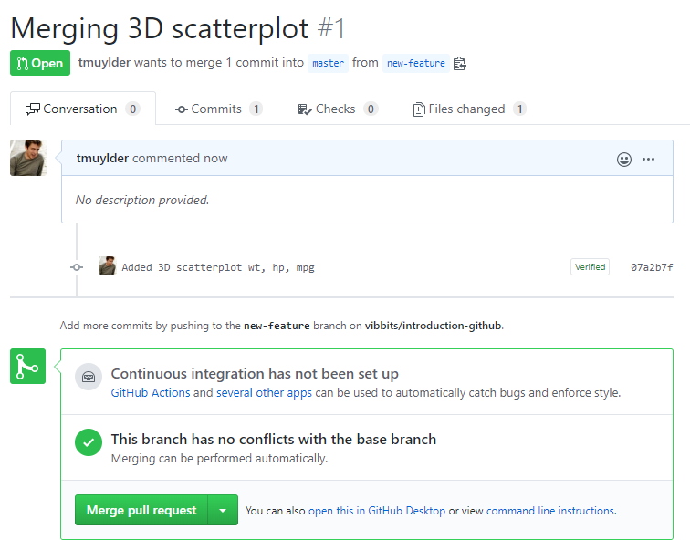</center>

---

It might be possible that in a project with several people, you are not authorized to make changes to the *main* branch. In this case you will always have to work in a separate branch and someone else will get this last message. He or she will then decide whether this pull request should be merged. 


## Example workflow
An example workflow is depicted in the figure below and is discussed in the following points. 

---

<center>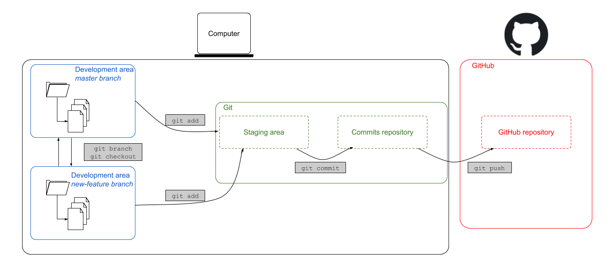</center>

---

**1. Make a new branch:**
```
git checkout -b <new-branch>
```
Git will make a new branch with the name `<new-branch>` and tell you it switched to the new branch. If you want to change branches, just type `git checkout` followed by the name of the branch, e.g. `git checkout main`.

**2. Make some changes:**
  - Add a new file
  - Edit an existing file

**3. Stage changes:**  
Use the following  command to simply add all the new or changed files. 
```
git add -A
```
 
**4. Commit staging area:**  
Commit all the staged files with:
```
git commit -m "some useful commit message"
```

**5. Push commits to GitHub:**

```
git push origin <new-branch>
```  
or alternatively:
```
git push --set-upstream origin <new-branch>
```
The `git push` command is now a bit longer. The first time we want to publish a new local branch on a remote repository (GitHub), we need to be explicit and tell Git to add the `<new-branch>` to the origin. In Git, the "origin" is used to refer to the GitHub original repository's URL and makes it much easier to talk about. 

Next time you want to push your commits from *new-branch*, you won’t need to be explicit - you can simply do `git push`, because now *new-branch* exists on GitHub and both branches know how to commmunicate with each other. 


---

As a final note on merging branches, we mention here that it is obviously also possible to merge branches on our computer locally. For this, we refer to some further reading materials linked [here](https://git-scm.com/book/en/v2/Git-Branching-Basic-Branching-and-Merging).

--

Switch back to your *main* branch and have a look to the `plot2.R`-file. It shouldn't contain these changes. 

## Deleting branches 

### Locally

Deleting a branch is as simple as typing the following command:

```
git branch -d <name-of-the-branch>
```

If git refuses to do so, there is a forced way to do it as well by using the capital `-D` parameter. 


### Via GitHub

If a branch is of no more use, we can delete it. To find all the existing branches in GitHub, click on *branches* in the top left corner of the repository.

---

<center>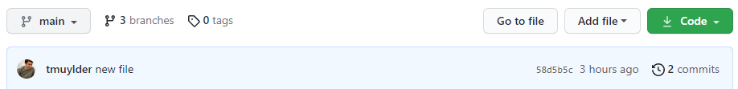</center>

---


After successfully merging our changes in the *main* branch, the old one(s) can be deleted. Click on the waste bin:

---

<center></center>

---

Go back to the main tab of the repository and find that the branch has been deleted. 

---


Let's continue with the [next session](https://liascript.github.io/course/?https://raw.githubusercontent.com/vibbits/introduction-github/master/tutorials/9_forks/tutorial.md#1)!