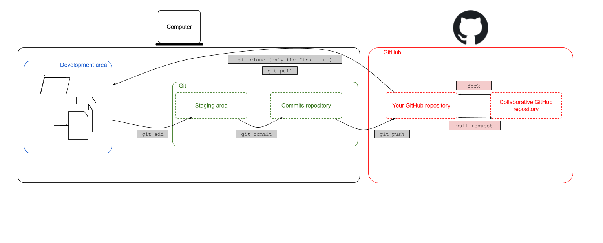
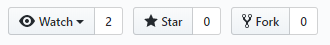
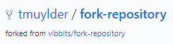
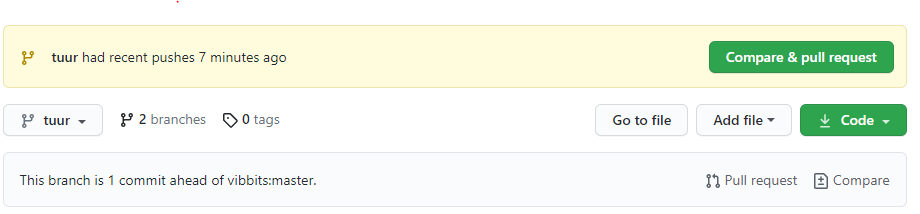
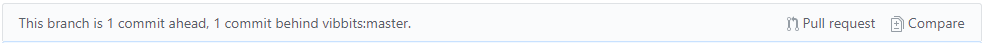
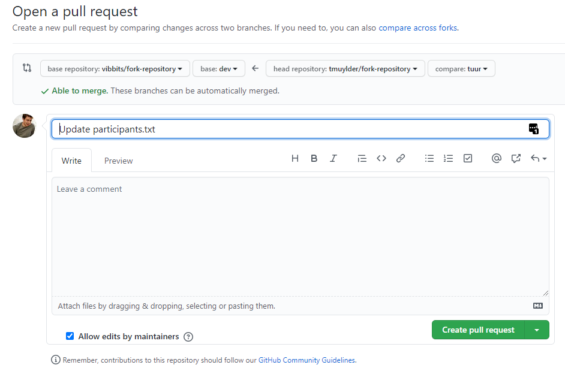

# 9. Forking

In this chapter we will discuss a second strategy for collaborating on projects. These strategies are especially useful when we do not have authorisation to change the content of someone else's project, even though we still have a useful edit/suggestion in mind.  

Forking is like starting the `multiverse` level of git. We started working on one time-line, simple and liner reality. Then we moved to parallel time-lines using branchs and now finally you can create a multiverse. When you `fork` a GitHub repository you create a copy of the current state of this repository on your own and you own it!

Basically one **forks** a central repository, making it a personal forked repository. This repository can constantly be up to date with the central repository by merging those upstream changes in your personal forked repository.  

After you forked a repository, it will appear as a new repository in your GitHub account. The next step would be to **clone** the repository locally so you can work on the project from your computer. It's always a good idea to make changes in a **new branch** and keep the *master* branch clean. Hence, after cloning the repository, you could make a new branch. Editing the files, staging, committing and pushing your changes remains the same and they will appear in your new personal forked repository. 

When you are happy about your changes, when all the commits are pushed to your forked repository, these changes can be merged back into the central repository by creating a **pull request**. The main author can now decide whether he/she is happy about your suggestions and can include (part of) them. This workflow leaves the central repository untouched untill the moment you want to incorporate changes.

---

---

Two important terms in this fork & pull workflow are:
- `upstream`: generally refers to the original repository that you have forked
- `origin`: is your fork: your own repository on GitHub  

As mentioned before, the "origin" is used to refer to the GitHub original repository's URL. This also lasts here. The remote `origin` refers to your fork on GitHub, not the original repository it was forked from. 

To summarize the above, the Fork & Pull workflow consists of the following steps:
1. Fork
2. Clone
3. Branch
4. Stage-commit-push
5. Pull request

# Fork
Let's explore GitHub first. GitHub is like the Facebook of programmers. You can see someone's account, what that person has been working on, find new projects (relatable to a Facebook page), etc. Exploring new repositories is possible by clicking on the 'Explore' button in the navigation bar. Searching a specific repository or searching for an account, on the other hand, is possible by simply typing it in the search bar in the navigation bar. 

---

---

Search for the VIB Bioinformatics Core account 'vibbits' and find the repository 'fork-repository'. This repository was made specifically for learning the concept of forking. Do this by clicking the fork button in the upper right corner.

---

---

The repository has been successfully forked if you see something similar to the figure below. The icon represents a fork, followed by your GitHub account name and the name of the repository. The second line tells us that the upstream repository is the 'vibbits/forked-repository'. 

---

---

## Changes
Clone this repository locally, make a branch (e.g. name it *yourname*) and do some edits in that branch. Add your name, accountname or initials and the date to the `participants.txt` file. For this exercise we will only edit the `participants.txt` file. The flow here remains the same: stage-commit-push. After these changes took place, we will have a similar situation 

---

---

In normal circumstances it is possible that the upstream repository has changed in the meantime. The indicator would then note that there are new commits in the upstream (`1 commit behind vibbits:main`), while the branch/repository itself is one commit ahead.  

---

---

This does not (really) affect the pull request. In any case, the following step is to create a pull request.

## Pull request
The two repositories have diverged during the previous steps. Now its time to create a pull request between these repositories. After clicking the **Pull request** a new screen pops up that looks very similar to the one seen in Chapter 5 (Branching & merging). Note that moste developers do not really appreciate it if you try to merge your changes straight into the *main* branch. Usually, they would write some suggestions as to how we can collaborate on a project preferably. Let's assume that the developers of this repository expect you to merge changes into the *dev* branch, than it would look something like this:

---

---

GitHub tells us:
- It compared the main branch of the forked repository (in my case *tmuylder/fork-repository*) with the upstream (base) repository *vibbits/fork-repository*. 
- It's able to merge these two branches without any conflicting errors
- It summarizes the changes that have been done in the branch that will be merged into the upstream.  

If all seems good, we can create the pull request. In the case that there are any conflicting errors, they will need to be solved first. Afterwards we only need to add a message that accompanies the pull request. 

A brief overview of the pull request is given in the following screen which either allows you to merge the pull request into the upstream repository yourself or which requests the maintainer of the upstream repository to review and merge the pull request. In the latter case, the maintainer will thereafter receive a notification showing the pull request. An overview of all pending pull requests where you are involved in, are consultable on the [pull requests](https://github.com/pulls) tab of the navigation bar.   

# Overview

To briefly summarize, the steps that we took were: *fork > clone(> branch > edit-stage-commit-push > pull request (> merge)* and represent a strategy for collaborating on projects. These strategies are especially useful when we do not have authorisation to change the content of someone else's project, even though we still have a useful edit/suggestion in mind.    
What if the upstream repository changed while you were working on your local repository? In this case a pull request should be done in which the receiving branch is your forked repository. Hence, the order of the branches as depicted in the figure above would be swapped.    

 --

Let's continue with the [next session](https://liascript.github.io/course/?https://raw.githubusercontent.com/vibbits/introduction-github/master/tutorials/10_Git_aliases/tutorial.md#1)!
